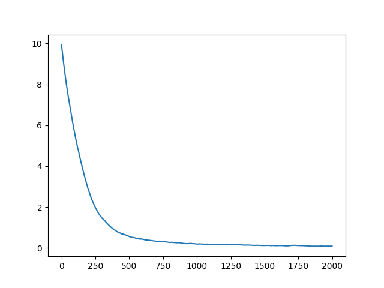

# Readme 
A replication of EBGU's Diffusion LM which trained on **small** part of ROCStory dataset in one GPU, which is the simple implementation and easy to understand

1. run `python trainer.py` for training.
2. run `python infer.py` for generating sample in unconditional way.
3. may be you could modify the `.yaml` file for some config setting.
4. multi-GPU training setting and full datasets can be found in the [origin codebase](https://github.com/EBGU/Diffusion-LM).

Main code idea is in the `diffusion_bert.py`    
- It shows that added nosie only in the word embedding before encoding by the `bert-encoder` (self-attention and full connection network).    
- Word embedding(with noise), position embedding, token_type embedding and time embedding are sum and feed to the bert encoder for getting a dim=768 vector.   
- The sample part is `bert.cls.predictions` to predict token in vocab which argmaxing the logits in each position.   

some change   
- add loss curve in ckpt folder
- add the sample result in test data
## sample result
It seems look good in English but it's overfited.    
```
[CLS] john was wanted a girlfriend so so he got dating dating. he went went on on date with her friend named joy came. she got five minutes. he got got angry for an angry friend. joy had a problem he had anger problem and problem, no hive hives. anna prevented him from finding she. [SEP]
```


## loss curve in 2000 steps


Correct me if I'm wrong or you have new understanding. Thks!

Origin papar is [diffusion-lm](https://arxiv.org/pdf/2205.14217.pdf)
